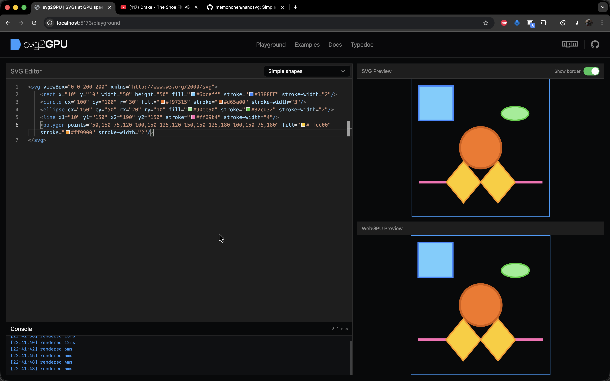
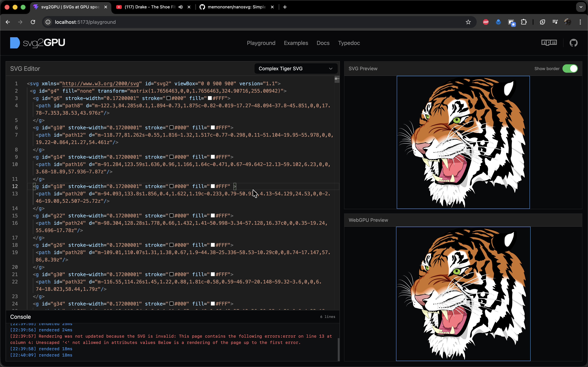
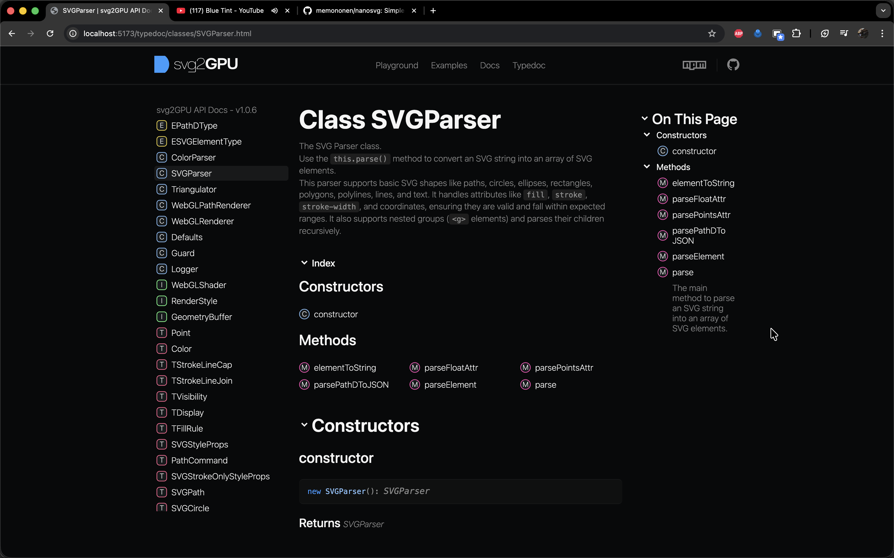

# Svg2GPU

`Svg2GPU` is a lightweight toolkit for parsing SVG data and rendering it through GPU pipelines. The current renderer implementation is WebGL-based, but the project is designed with a WebGPU-oriented direction in mind: predictable geometry processing, typed rendering data, and tooling that maps well to modern GPU workflows.

The Playground is the fastest way to understand the project in practice. You can load multiple SVG examples, edit them live, and instantly compare native SVG output with the GPU-rendered result. It also includes validation feedback and a terminal-style log so you can iterate safely while experimenting with complex shapes.

TypeDoc is included to make the API surface easy to explore. It documents core parser and renderer types, enums, and utilities, so you can quickly move from interactive experimentation to real integration in your own app.

  
  

[Open TypeDoc](/typedoc/)

